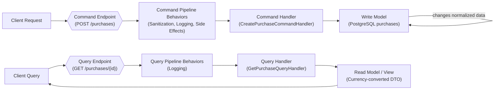
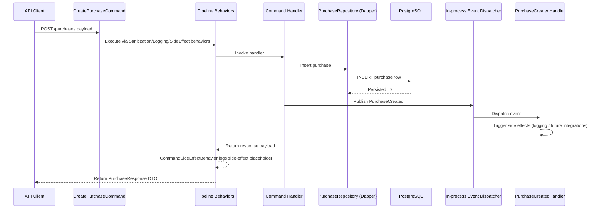

# Purchase Service

Purchase Service is an ASP.NET Core 9.0 minimal API built for didactic purposes: it showcases patterns such as CQRS, MediatR behaviors, and centralized exception handling. It stores purchase transactions in PostgreSQL and retrieves them converted to foreign currencies using the U.S. Treasury Reporting Rates of Exchange.

## Architecture Overview

### CQRS

The service uses a simple in-process CQRS setup (`src/PurchaseService.Api/Mediator`) to separate commands that change state from queries that read data.

- High-level data flow:



- How this project combines CQRS with internal event sourcing:



- **Commands** – `CreatePurchaseCommand` writes a purchase entry (`CreatePurchaseCommandHandler`).
- **Queries** – `GetPurchaseQuery` reads and converts an existing purchase (`GetPurchaseQueryHandler`).

### Pipeline Behaviors

Commands and queries flow through MediatR-style pipeline behaviors before hitting their handlers:

- `CommandSanitizationBehavior` trims descriptions, rounds amounts, and rejects invalid command payloads (HTTP 400 via `RequestValidationException`).
- `RequestLoggingBehavior` logs entry/exit for every request and records total execution time.
- `CommandSideEffectBehavior` represents post-command side effects; it currently logs where an AMQP message would be published.

### Event Sourcing (Internal)

Handlers publish events to an in-process dispatcher (`EventDispatcher`):

- **Event** – `PurchaseCreated` captures the purchase ID, description, date, and amount.
- **Handler** – `PurchaseCreatedHandler` currently logs that the event fired, illustrating where downstream side effects would occur.

This setup keeps command handlers focused on domain logic while allowing additional subscribers to react to domain events later.

### Caching

Treasury exchange rates are cached in-memory (`CurrencyConversionService`/`TreasuryRatesClient`) using the configured `TreasuryRates:CacheDurationSeconds` so repeated currency lookups do not hammer the external API. Rates come from the U.S. Treasury Reporting Rates of Exchange.

### Persistence Choice

For writes we stuck with straight Dapper because the service is small and the domain logic around `CreatePurchaseCommand` is limited. In a larger system it is common to combine EF Core (richer change-tracking, migrations) for command-handling with Dapper for read-side queries; the project layout keeps that door open should the service need to grow.

## Project Conventions

- **Infrastructure adapters** – Cross-cutting plumbing that only touches external dependencies lives in `src/PurchaseService.Api/Infrastructure`. `DateOnlyTypeHandler` sits there because it only adapts Dapper’s database representation of dates and never interacts with domain logic.
- **Collocated contracts** – Interfaces that exist solely to support a single implementation plus test doubles stay beside their class (e.g., `ITreasuryRatesClient`/`TreasuryRatesClient`). Once a contract gains multiple implementations or wider reuse, it is promoted to its own file to flag the boundary explicitly.
- **Exception handling** – `PurchaseExceptionHandler` centralizes HTTP error mapping using `IExceptionHandler`, keeping controllers/minimal endpoints free of status-code branching while enforcing consistent response envelopes.
- **Slim endpoints** – Minimal API endpoints delegate immediately to MediatR commands/queries. Each command encapsulates validation and domain rules, letting controllers stay declarative (`app.MapPost`, etc.) while the pipeline enforces behaviors (logging, sanitization, side effects).
  - Domain isolation: request handlers validate invariants via FluentValidation, convert to value objects/entities, and publish domain events; infrastructure concerns (DB, HTTP) are injected, so command/query code focuses on business rules.

### Reuse vs. Service-Specific Code

- **Candidate libraries**
  - `CommandSanitizationBehavior`, `RequestLoggingBehavior`, `CommandSideEffectBehavior` – reusable MediatR pipeline behaviors for sanitization, logging, and side-effect hooks.
  - `PurchaseExceptionHandler` pattern – a generic `IExceptionHandler` wrapper that maps custom exceptions to consistent problem details.
  - `DateOnlyTypeHandler` – Dapper adapter for `DateOnly`, usable by any service that persists dates.
  - Treasury API client abstractions – `ITreasuryRatesClient`/`CurrencyConversionService` illustrate an HTTP + caching client that could be parameterized for other rate providers.
- **Service-specific routines**
  - Purchase domain commands/queries (`CreatePurchaseCommand`, `GetPurchaseQuery`) and their validators – enforce business rules unique to this service.
  - `PurchaseRepository` and related Dapper SQL – bound to the purchases schema and table layout.
  - `PurchaseCreated` event and handler – internal event model for downstream purchase workflows.
  - `PurchaseRequest` DTOs and FluentValidation rules – tied to this API’s contract signatures.

### Example Requests (Development)

Create a purchase:

```bash
curl -X POST https://purchase-service-development.up.railway.app/purchases \
  -H "Content-Type: application/json" \
  -d '{
        "description": "Coffee",
        "transactionDate": "2024-06-25",
        "amount": 12.34
      }'
```

Query a converted purchase:

```bash
curl "https://purchase-service-development.up.railway.app/purchases/{purchaseId}?currency=Euro"
```

## Local Execution Requirements

- .NET SDK 9.0.306 or later
- Docker (for optional local database and integration tests)

## Configuration

The service reads configuration from `appsettings.json` and environment variables. Key settings include:

- `Database:ConnectionString` – PostgreSQL connection string. Defaults to `Host=localhost;Port=5432;Database=purchases;Username=postgres;Password=postgres`.
- `TreasuryRates:BaseUrl` – base URL for the Treasury exchange-rate API.
- `TreasuryRates:CacheDurationSeconds` – in-memory cache duration (seconds) for Treasury exchange-rate lookups. Defaults to `300`.

Environment variables can override configuration using the `__` separator, e.g.

```bash
export Database__ConnectionString="Host=localhost;Port=5432;Database=purchases;Username=postgres;Password=postgres"
```

## Running the API

1. Ensure PostgreSQL is available (run `docker compose up db` or point to an existing instance) and confirm the connection string in `appsettings.Local.json`/environment variables.
2. Restore dependencies and build:
   ```bash
   dotnet build
   ```
3. Start the API (schema migrations run automatically at startup):
   ```bash
   dotnet run --project src/PurchaseService.Api
   ```
4. The API listens on `http://localhost:8080` when containerized and the ASP.NET Core default port (usually `http://localhost:5000`) when run directly. Use `src/PurchaseService.Api/PurchaseService.Api.http` or the `curl` examples above to verify.

## Docker Compose

A `docker-compose.yml` file is provided to run both the API and PostgreSQL:

```bash
docker compose up --build
```

The API becomes available on `http://localhost:8080` and uses the compose-provisioned database service.

## API Endpoints

- `POST /purchases`
  - Body: `{ "description": "Coffee", "transactionDate": "2024-06-25", "amount": 12.34 }`
  - Stores a purchase and returns the persisted payload with the generated identifier.
- `GET /purchases/{id}?currency=Euro`
  - Retrieves the purchase in the requested currency, returning the exchange rate and converted amount.

Validation rules:

- Description: required, max 50 characters.
- Transaction date: required, ISO-8601 date.
- Amount: positive and rounded to two decimal places.

Conversion rules:

- Uses the latest Treasury exchange rate on or before the purchase date, up to six months prior.
- Returns a 400 error if no eligible rate exists.

## Quality Assurance

- **Unit tests** – `tests/PurchaseService.Api.Tests/Services/CurrencyConversionServiceTests.cs` exercises exchange-rate lookup, caching behavior, and error paths; `tests/PurchaseService.Api.Tests/Validation/PurchaseRequestValidatorTests.cs` covers the fluent validation rules for incoming payloads.
- **Integration tests** – `tests/PurchaseService.Api.Tests/Integration/PurchaseApiTests.cs` hits the HTTP endpoints through `PurchaseApiFactory`, optionally running against a Testcontainers-based PostgreSQL instance when `RUN_DOCKER_TESTS` is enabled.
- **Supporting doubles** – `tests/PurchaseService.Api.Tests/TestDoubles/TestTreasuryRatesClient.cs` provides deterministic exchange-rate responses so service tests stay hermetic.
- **How to run** – `dotnet test` runs the unit suite; export `RUN_DOCKER_TESTS=1` before invoking it to include the container-backed integration suite.

## Automated Tests

Restore and run the test suite:

```bash
dotnet test
```

Unit tests run by default. Integration tests that depend on Docker are skipped unless explicitly enabled:

```bash
export RUN_DOCKER_TESTS=1
DOTNET_CLI_HOME=$PWD/.dotnet dotnet test
```

Ensure Docker is running before enabling these tests.

## Branching & Release Flow

- **Feature branches** – Start new work from `develop` (`git checkout -b feature/<name>`), keep commits focused, and open a PR back into `develop`. Every merge must pass review plus the automated test suite.
- **Continuous integration** – The `develop` branch represents the integration line; merges into it automatically trigger a deploy to the Railway `develop` environment.
- **Releases** – When `develop` is production-ready, create `release/<version>` from it, apply final touches (changelog, version bump), and open a PR into `main`.
- **Production** – Merging into `main` triggers the deployment to the production Railway environment. The release branch can be deleted once merged.
- **Hotfixes** – Critical production issues branch from `main` (`hotfix/<issue>`), ship the fix, and merge back into both `main` and `develop` to keep streams aligned.

## Continuous Integration & Security Testing

Everything runs through `.github/workflows/code-quality.yml`, which orchestrates the code-quality and security checks whenever `develop` or `main` receives new commits.

### Analyze Stage

- Trigger – every push or pull request targeting `develop` or `main`.
- Tasks – `dotnet restore`, `dotnet format --verify-no-changes --no-restore`, and `dotnet build --configuration Release -warnaserror --no-restore`. This keeps style, analyzers, and baseline build health enforced before any security scans execute.
- Outcome – upstream stages must pass before the security tooling (CodeQL, ZAP) is allowed to run.

### Static Application Security Testing (SAST)

- Trigger – runs on `main` once the analyze stage succeeds.
- Tooling – [GitHub CodeQL](https://github.com/github/codeql) inspects the C# projects for common CWE patterns (SQL injection, path traversal, unsafe deserialization).
- Results – alerts appear under “Security > Code scanning alerts”, each with file/line references and data-flow traces for easier remediation.
- Local reproduction – install the [CodeQL CLI](https://codeql.github.com/docs/codeql-cli/) and mimic the workflow (`codeql database create`, `codeql database analyze`) when verifying fixes before pushing.

### Runtime Application Security Testing (RAST)

- Trigger – executes on `main` after analyze completes.
- Tooling – [OWASP ZAP Baseline](https://www.zaproxy.org/docs/docker/baseline-scan/) runs against a locally hosted API.
- Environment – the job provisions PostgreSQL, boots the API via `dotnet run` bound to `http://0.0.0.0:8080`, waits for `/openapi/v1.json` or `/swagger/index.html`, and performs passive scans.
- Compliance – ZAP findings about cacheable responses are mitigated through the middleware in `src/PurchaseService.Api/Program.cs` that forces `Cache-Control: no-store`. `Sec-Fetch-Dest` warnings stem from scanner client behavior and are tracked as informational.
- Artifacts – the workflow uploads a `zap-scan` bundle with the HTML report (`Actions > Code Quality > Artifacts`).
- Local reproduction – run the API locally and execute `docker run --rm --network host -v $(pwd):/zap/wrk:o zaproxy/zap-baseline -t http://127.0.0.1:8080 -r zap-report.html` to iterate on fixes without waiting for CI.

## Deploying to Railway

### Prerequisites

- Railway CLI installed (`npm install -g @railway/cli`)
- Logged in and linked to the project:
  ```bash
  railway login
  railway link
  ```

### Environments

- `develop` – https://purchase-service-development.up.railway.app
- `production` – https://purchase-service-production.up.railway.app

Each environment must have the following variables set (adjust to match the provisioned PostgreSQL instance):

- `ASPNETCORE_ENVIRONMENT` (`Develop` or `Production`)
- `DATABASE_URL_DEVELOP` (develop) / `DATABASE_URL_PRODUCTION` (production) – full PostgreSQL URL from the Railway database plugin
- Optional: `TreasuryRates__BaseUrl`, `TreasuryRates__UserAgent`, etc., if overriding defaults

### Deploy commands

Publish the Docker image and deploy the current workspace:

#### Develop
1. Log in and link the project (one-time):
   ```bash
   railway login
   railway link
   ```
2. Ensure `DATABASE_URL_DEVELOP` and other settings are defined (`railway variables --environment develop`).
3. Deploy the latest code:
   ```bash
   railway up --environment develop
   ```
4. Watch logs (optional):
   ```bash
   railway logs --environment develop
   ```

#### Production
1. Confirm all production environment variables (especially `DATABASE_URL_PRODUCTION`) are set.
2. Trigger the deployment:
   ```bash
   railway up --environment production
   ```
3. Verify logs and health:
   ```bash
   railway logs --environment production
   ```

View logs:

```bash
railway logs --environment develop
```

> After updating environment variables in the dashboard or via CLI, trigger a redeploy (`railway redeploy --environment <env>` or `railway up …`) to apply the changes.
